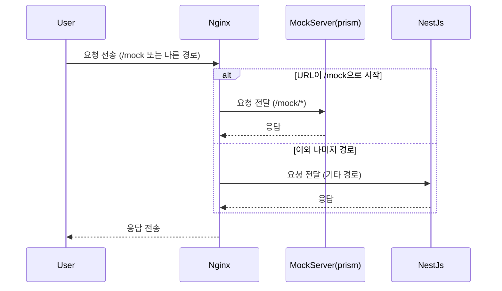
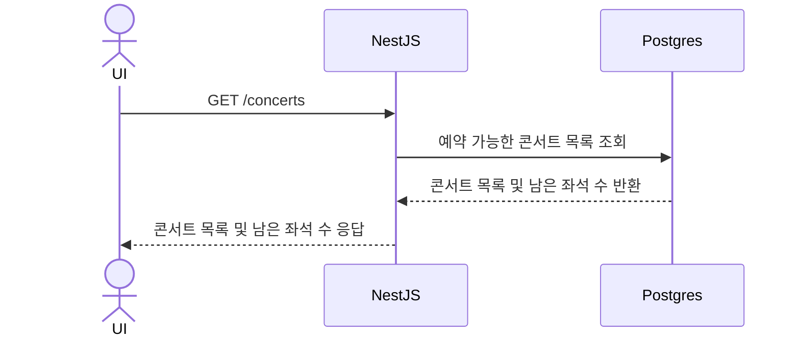
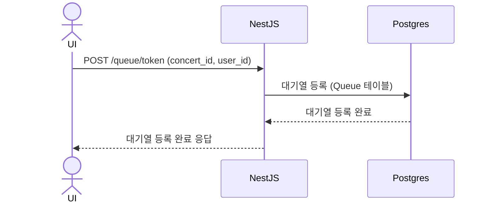
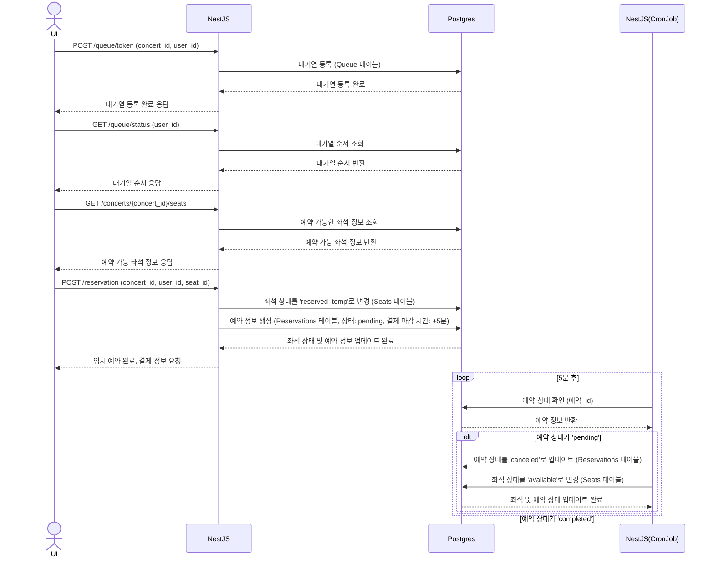
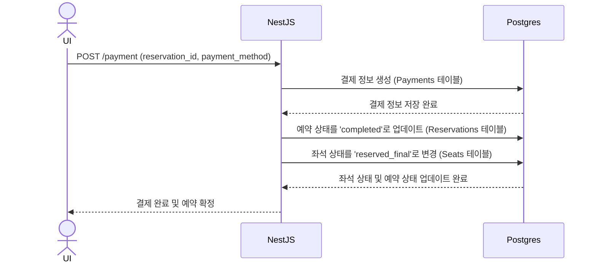
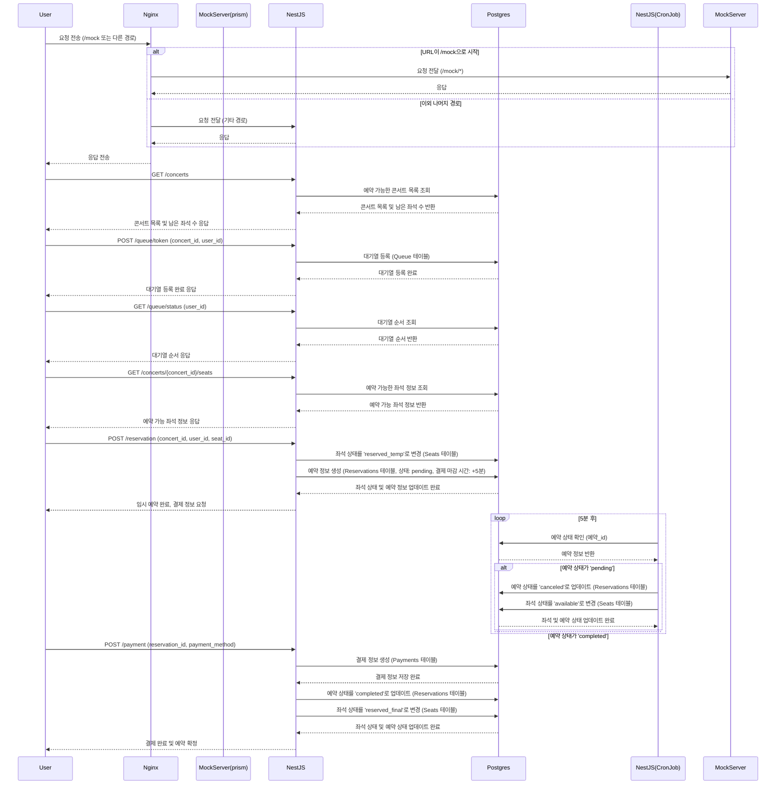

## 1. 시나리오 선정 
 - 콘서트 예약 서비스
 - 이유: 대기열 생성, 좌석 예약, 결제 등 다양한 기능이 학습하기에 매우 좋아보였다.

## 2. 프로젝트 마일스톤
    마일스톤 깃허브로 만들었기에 깃허브 링크로 제출합니다.
    https://github.com/users/getBlackBadge/projects/1

## 3. 요구사항 분석 자료
### 요약
- 대기열은 queue테이블에 저장한다
- 예약을 하면 reservation테이블에 만료시간과 좌석 등 결제시 필요한 정보를 저장하고 seat테이블의 status를 업데이트한다
- reservation테이블에 row를 추가할 때, nest cronjob으로 5분 뒤 해당 id를 조회하고 상태를 확인한다. 만료 시간이 지났나면 해당 예약을 무효화한다.
- reservation_id를 가지고 결제를 진행한다. 

### 시퀀스 다이어그램
### 1. mock-server
    nginx에서 /mock로 시작하는 요청은 MockServer로 전송한다

### 2. 콘서트 목록 확인

### 3. 대기열 등록

### 4. 좌석 예약

### 5. 결제

### 6. 전체

