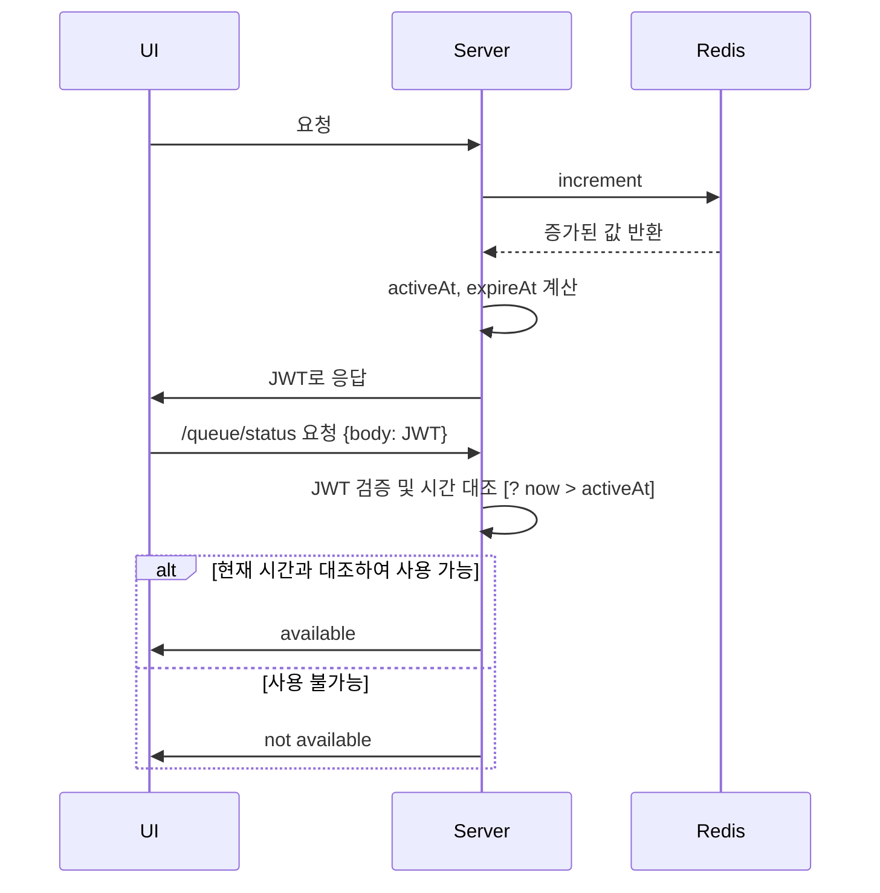

# 성능 개선을 위한 Redis 활용 방안

## 목표
조회가 오래 걸리는 쿼리의 성능을 개선하기 위한 캐싱 및 Redis를 활용한 로직 이관

---

### 1. 대기열 처리 (Queue Management)

**전제:**  
트래픽이 특정 시간에 많이 모인다는 가정하에 대기열 처리를 고려합니다. 

**유량 제어 방법:**

- **첫 번째 방법:**  
  `n 명이 나갈 때마다 n 명이 들어오는 방식`.  
  이 방법은 대기자가 나가지 않으면 처리에 어려움이 있으며, 유량 제어가 까다롭고 추가적인 처리가 필요합니다. 더불어, 해당 상황에서 의미도 크게 없습니다.

- **두 번째 방법:**  
  `시간당 일정 인원(예: 100명)을 처리하는 방식`.  
  이 방법은 대기자가 나가지 않더라도 시간이 지나면 자연스럽게 요청이 처리되므로 유량 제어에 효과적입니다. 콘서트 서비스에서는 두 번째 방법을 채택합니다.

**결론: [Redis와 JWT 활용]**

- **Redis:**  
  Redis의 `increment` 명령어를 사용하여 특정 키 값을 1씩 증가시키는 방식으로 대기열을 관리할 수 있습니다. 이 방식은 다중 인스턴스 환경에서 중복 없이 동기화를 보장하며, 리소스를 절약할 수 있습니다.

- **JWT:**  
  두 번째 방법으로 유량을 제어한다면, 사용자가 대기열 요청 시점에 토큰의 `activeAt` 시간을 미리 알 수 있습니다. 해당 토큰 정보를 레디스에 저장할 수도 있겠지만 추가적인 메모리를 사용하게 됩니다. 하지만 JWT를 사용한다면 토큰 활성 시간 등의 정보를 서버에 저장하지 않고 클라이언트에 저장하여 서버의 부하를 줄일 수 있습니다. JWT에 요청 순서와 만료시간 등의 정보를 저장함으로써 대기열 처리 시 서버는 추가적인 저장을 하지 않아도 됩니다. 자연스럽게 Redis 요청 횟수도 줄어들게 됩니다.

---

### 2. 트랜잭션 락 처리 (Transaction Lock)

**문제:**  
기존의 데이터베이스 트랜잭션 락은 많은 요청을 처리하는 환경에서 성능 저하를 초래할 수 있습니다. 특히, MSA 환경에서는 여러 데이터베이스 서버가 존재하기 때문에 트랜잭션 락 기능에 한계가 발생할 수 있습니다.

**결론: [Redis 분산 락 활용]**

- **Redis로 락 이관:**  
  Redis를 사용하여 트랜잭션 락을 처리하면 데이터베이스에서 발생하는 부하를 줄일 수 있습니다. Redis는 빠르고 확장 가능한 락 처리가 가능하여 성능 향상에 기여합니다.

- **MSA 환경에 적합:**  
  MSA 환경에서 여러 개의 데이터베이스 서버를 사용할 경우, Redis를 사용하여 트랜잭션 락을 중앙에서 관리함으로써 효율적으로 락을 처리할 수 있습니다.

**중요한 점:**  
트랜잭션 등이 끝나기 전에 락을 절대 해제하지 않는 것이 중요합니다. 이를 통해 데이터의 일관성을 유지할 수 있습니다.

---

### 3. 콘서트 정보 조회 API (Concert Info API)

#### 캐시 이론 (Cache Theory)

- **캐시 지역성 (Cache Locality):**  
  간략하게 요약하자면 `cache hit`은 근방에서 이루어진다는 것입니다.

#### 캐시 활용 방안:

- **적은 양의 캐시로 높은 Cache Hit Rate 달성:**  
  콘서트 예매 시간에는 많은 사용자들이 해당 콘서트 정보를 조회하므로, 콘서트 정보를 캐시에 저장하여 빠른 조회를 가능하게 할 수 있습니다. 이를 통해 캐시 지역성을 활용하여 적은 양의 캐시로 높은 Cache Hit Rate를 달성할 수 있습니다.

### 4. 예약정보 저장

- **예약정보는 데이터베이스에:** 
 예약 정보도 데이터베이스 말고 Redis에 저장하면 어떨지에 대해 고민이 많이 되었습니다. 하지만 유저 입장에서 힘들게 이뤄낸 예약정보가 사라진다면 치명적일 것이라 생각했습니다. 그래서 결국 예약 정보는 문제 발생 시 데이터 복구에 더 유리한 기존의 데이터베이스에 저장하는 방식을 유지하기로 결정했습니다.