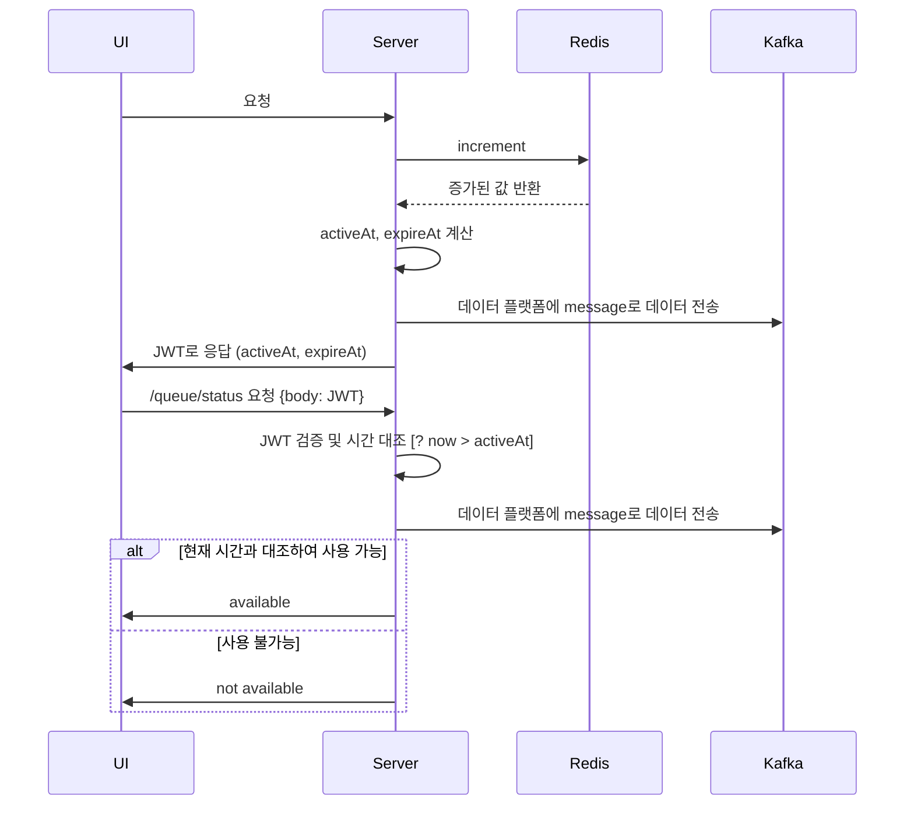
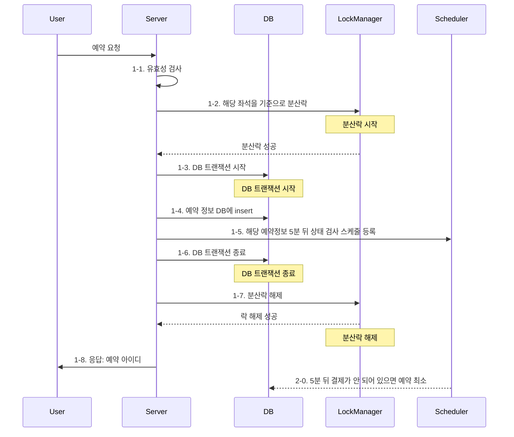
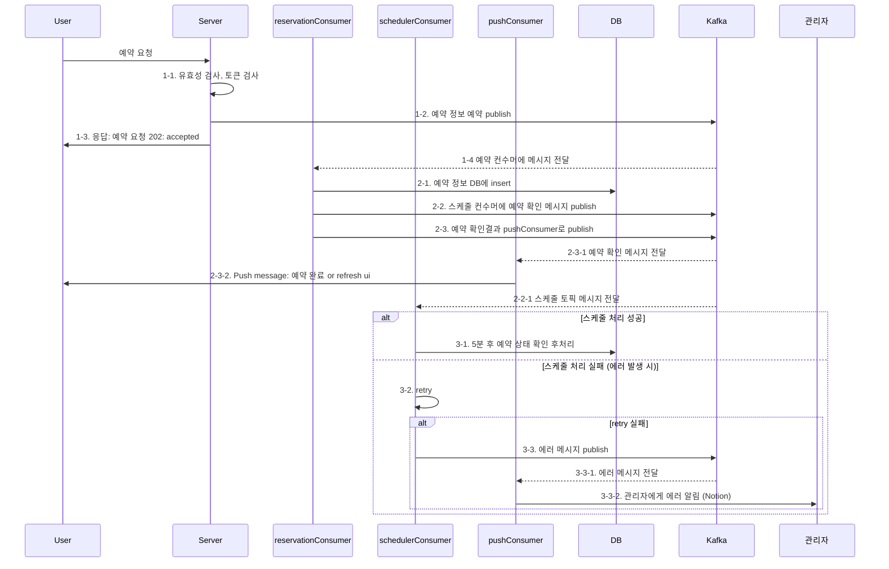
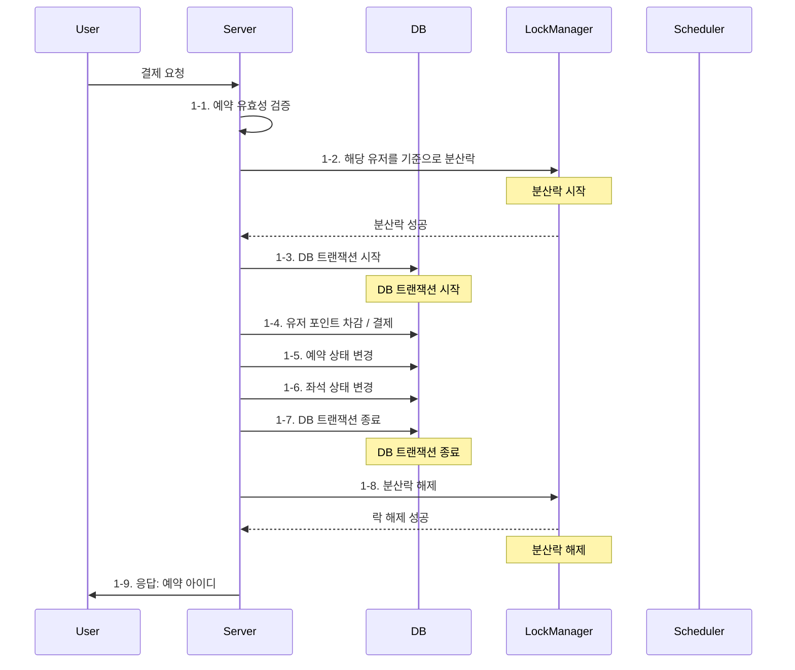
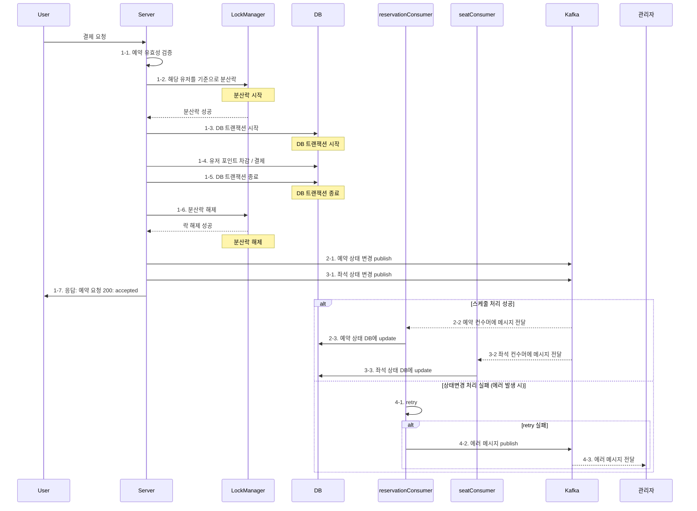
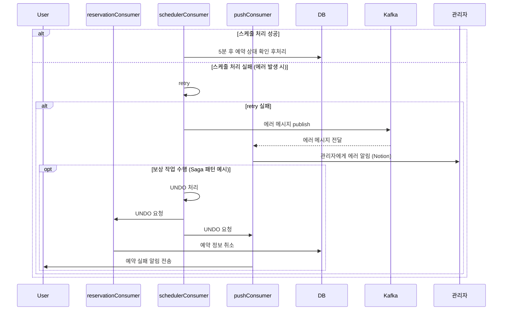

# **STEP 16_심화**

## 16-1. 내가 개발한 기능의 트랜잭션 범위에 대해 이해하고, 서비스의 규모가 확장된다면 서비스들을 어떻게 분리하고 그 분리에 따른 트랜잭션 처리의 한계와 해결방안에 대한 서비스설계 문서 작성

## 16-2. 실시간 주문, 좌석예약 정보를 데이터 플랫폼에 전달하거나 이력 데이터를 저장 (외부 API 호출, 메시지 발행 등) 하는 요구사항 등을 기존 로직에 추가해 보고 기존 로직에 영향 없이 부가 기능을 제공

---

### 16-1. 서비스설계 문서

#### 개요: 서비스의 규모가 확장된다면, 서비스들을 어떻게 분리할 수 있을까요? 기본 서비스 로직과 메시지 큐 및 MSA 개념을 적절히 활용한다면 서비스 규모의 확장에 효과적으로 대응할 수 있습니다. 이번에는 콘서트 예약 서비스의 핵심인 1. 대기열, 2. 예약, 3. 결제에 대해 집중적으로 알아보고자 합니다.

---
### 기존과 개선 방안 설계
#### 대기열
- **[Before] 기존의 트랜잭션 범위**:
  - 기존의 대기열 요청 동작은 다음과 같습니다:
    1. Redis increment를 통해 요청 순서를 파악합니다.
    2. 기존의 유량 계획에 따라 active at 순서를 확인합니다.
    3. JWT에 토큰 정보를 저장한 후 (active at, expire at 등) 사용자에게 반환합니다.

- **[After] 설계**:
  - 대기열은 이미 많은 최적화를 거쳐왔으므로, 메인 로직을 유지하기로 결정했습니다.
  - 데이터 기반 의사결정을 위해, 데이터를 다른 데이터 플랫폼에 저장하는 로직을 추가합니다.
  - 추가적인 로직은 메시지 큐로 넘기고, 에러는 별도로 처리합니다.

---
#### 예약
- **[Before] 기존의 트랜잭션 범위**:
  - 기존의 예약 요청 동작은 다음과 같습니다.
    1. 유효성 검사
    2. 해당 좌석을 기준으로 분산락
    3. DB 트랜잭션 시작
    4. 예약 정보 DB에 insert
    5. scheduler: 해당 예약정보 5분 뒤 상태 검사 로직 -> 결제가 안되어있으면 예약 최소
    6. DB 트랜잭션 종료
    7. 분산락 해제
    8. 응답: 예약 아이디 

- **[After] 설계**:
  - reservationConsumer, schedulerConsumer, pushConsumer로 나눕니다.
  - 서버는 200의 예약 완료 응답에서 202 accepted로 응답 코드로 변경합니다.
  - 메인 로직을 담당하는 message consumer들 중 하나가 실패했을 시 처리방안은 뒤에 `트랜잭션 처리의 한계와 해결방안` 에서 다루겠습니다.
  - 부수적인 scheduler는 재시도 후 해결이 안될 경우 Notion으로 관리자에게 알리고 관리자가 처리합니다.

---
#### 결제
- **[Before] 기존의 트랜잭션 범위**:
  - 기존
    1. 예약 유효성 검증
    2. 분산락 획득
    3. DB 트랜잭션 시작
    4. 포인트 차감 / 결제
    5. 예약 상태 변경
    6. 좌석 상태 변경
    7. DB 트랜잭션 종료
    8. 분산락 해제
    9. 결과 응답

- **[After] 설계**:
  - `1-4. 유저 포인트 차감 / 결제`는 매우 민감한 문제이므로 서버에서 직접 처리합니다
  - `1-5. 예약 상태 변경`, `1-6. 좌석 상태 변경` 로직을 따로 message queue로 분리합니다 
  - `1-5`, `1-6`의 상태변경에서 문제가 생겼을 시 retry시도, notion으로 관리자에게 전달을 시도합니다.
  - 최악의 경우 해당 결제의 모든 동작을 되돌리는 보상 트랜잭션 로직도 구현합니다. (여기까지 온다면 짤린다는 각오로)

## 트랜잭션 처리의 한계와 해결방안

#### MSA 환경으로 분리할수록 트랜잭션 처리가 까다로워지는 것은 틀림없는 사실입니다.  
Retry로 해결이 안 될 때, 최악의 경우 결국 모든 것을 되돌려야 하는 상황이 올 수도 있습니다.  
이럴 때, **Saga 패턴**을 활용할 수 있습니다.

#### Saga 패턴
Saga 패턴은 분산 트랜잭션의 대안으로 널리 사용됩니다.  
각 서비스는 자신만의 로컬 트랜잭션을 수행하며, 전체 트랜잭션을 완료하기 위해 필요한 다른 서비스의 작업을 이벤트 기반으로 연결합니다.  
실패 시 각 서비스는 보상 작업을 수행하여 상태를 원래대로 되돌립니다.  
이러한 방식은 트랜잭션을 분산하는 대신, 각 작업을 독립적으로 관리하여 일관성을 유지할 수 있게 합니다.

#### 구체적인 계획
우선은 최대한 **retry**로 해결하려 시도합니다.  
해결이 안 되는 경우를 위해 모든 이벤트 기반 동작들은 **do/undo**를 둘 다 구현합니다.  
에러가 발생했을 시 해당 동작의 **undo** 이벤트를 전파합니다.  
전파 범위는 에러가 발생한 이벤트와 대상 프로세스의 상태를 보고 결정합니다.

#### 예시

## 결론: 은탄환은 없다

다만 **배달의 민족에겐 배달이 있고, 콘서트 예약 서비스엔 예약이 있습니다.**  
`예약`이 우리 비즈니스의 핵심이라는 것을 이해하고, 배달의 민족이 배달이라는 서비스가 고객에게 도달할 때 까지를 관리하는 것 처럼, 우리도 예약의 생명주기 관리를 위해 대기열에서부터 예약 확정까지, 무덤에서 요람까지 상태에 맞게 잘 처리하는 것이 중요합니다.

---

## 16-2. 메시지 발행: 기존 로직에 영향 없이 부가 기능 추가

기존 코드에 `event emitter`를 추가했습니다.  
현재 emitter는 부수적인 요청을 처리합니다:  
- 데이터 플랫폼에 요청 결과 전송  
- 현금 영수증 발행 등

listener는 해당 요청을 듣고 메시지를 `console.log`로 출력하는 mock listener입니다.  
Kafka 구현 시 실제 로직으로 대체할 예정입니다.
